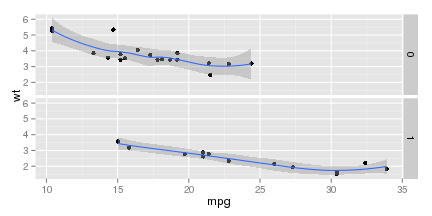

## Executive Summary
This report attempts to answer the question "Is a car with automatic transmission perform better on MPG compared to a manual one?" Although a simpler analysis might point to a "Yes," further analysis shows that __*there is no significant effect of presence or absence of an automatic transmission on the MPG of a car*__ withing the ```mtcars``` dataset. The average MPG of cars with automatic and manual transmissions is indeed significantly different but the difference is explained by the fact that cars with manual transmission in the dataset get lower MPG presumably due to them being heavier and not because they have manual transmissions. 

Let's plot the MPG of the cars as function of their weight with manual (am=0) and auto (am=1) transmissions: 

```r
#The warnings/messages from this section are hidden
library(ggplot2)
ggplot(data=mtcars,aes(mpg,wt)) + geom_point() + facet_grid(facets = am ~ .) + geom_smooth()
```

 

Looks like the cars with automatic transmission have higher MPG, but they also weigh less on an average.

Let's calculate the mean MPG and weight of manual and auto cars:

```r
manualcars <- mtcars[mtcars$am == 0,]
autocars <- mtcars[mtcars$am == 1,]
#Mean MPG/Weight of cars with manual transmission
mean(manualcars$mpg) ; mean(manualcars$wt)
```

```
## [1] 17.14737
```

```
## [1] 3.768895
```

```r
#Mean MPG/Weight of cars with automatic transmission
mean(autocars$mpg); mean(autocars$wt)
```

```
## [1] 24.39231
```

```
## [1] 2.411
```

Clearly, this confirms that the cars with automatic transmission have significantly higher MPG, but they also weigh less on an average. This is verified by a T-test in the appendix.

Now let's fit a linear model between 'am' as the predictor and 'mpg' as the outcome.


```r
fit <- lm(mpg ~ am,data=mtcars)
summary(fit)
```

```
## 
## Call:
## lm(formula = mpg ~ am, data = mtcars)
## 
## Residuals:
##     Min      1Q  Median      3Q     Max 
## -9.3923 -3.0923 -0.2974  3.2439  9.5077 
## 
## Coefficients:
##             Estimate Std. Error t value Pr(>|t|)    
## (Intercept)   17.147      1.125  15.247 1.13e-15 ***
## am             7.245      1.764   4.106 0.000285 ***
## ---
## Signif. codes:  0 '***' 0.001 '**' 0.01 '*' 0.05 '.' 0.1 ' ' 1
## 
## Residual standard error: 4.902 on 30 degrees of freedom
## Multiple R-squared:  0.3598,	Adjusted R-squared:  0.3385 
## F-statistic: 16.86 on 1 and 30 DF,  p-value: 0.000285
```

The 'intercept' and 'am' intercept are respectively, the mean MPG (17.147) of cars with manual and the increase (7.245) in MPG by moving to an automatic transmission. We can see that there is a significant relationship between the two (am and mpg) indicated by the '***'. The estimate column confirms the MPG means we computed earlier for cars with manual and automatic transmissions. 

The residual plots for the fitted model are in Figure A1 in the appendix. There doesn't seem to be any obvious pattern in the residual plots, but a correlation between residuals and weight of the cars suggests that the model may improve by adding 'wt' as a predictor (See appendix).

The R^2 value indicates that about 33.3% of the variance in MPG is explained by the 'am' variable, so let's fit models with more predictors and use ANOVA to quantify if addition of these predictors improve the model accuracy.


```r
fit1 <- lm(formula = mpg ~ wt, data = mtcars)
fit2 <- lm(formula = mpg ~ wt + am, data = mtcars)
fit3 <- lm(formula = mpg ~ wt + am + cyl, data = mtcars)
fit4 <- lm(formula = mpg ~ wt + am + cyl + hp, data = mtcars)
summary(fit4)
```

```
## 
## Call:
## lm(formula = mpg ~ wt + am + cyl + hp, data = mtcars)
## 
## Residuals:
##     Min      1Q  Median      3Q     Max 
## -3.4765 -1.8471 -0.5544  1.2758  5.6608 
## 
## Coefficients:
##             Estimate Std. Error t value Pr(>|t|)    
## (Intercept) 36.14654    3.10478  11.642 4.94e-12 ***
## wt          -2.60648    0.91984  -2.834   0.0086 ** 
## am           1.47805    1.44115   1.026   0.3142    
## cyl         -0.74516    0.58279  -1.279   0.2119    
## hp          -0.02495    0.01365  -1.828   0.0786 .  
## ---
## Signif. codes:  0 '***' 0.001 '**' 0.01 '*' 0.05 '.' 0.1 ' ' 1
## 
## Residual standard error: 2.509 on 27 degrees of freedom
## Multiple R-squared:  0.849,	Adjusted R-squared:  0.8267 
## F-statistic: 37.96 on 4 and 27 DF,  p-value: 1.025e-10
```

```r
anova(fit1,fit2,fit3,fit4)
```

```
## Analysis of Variance Table
## 
## Model 1: mpg ~ wt
## Model 2: mpg ~ wt + am
## Model 3: mpg ~ wt + am + cyl
## Model 4: mpg ~ wt + am + cyl + hp
##   Res.Df    RSS Df Sum of Sq       F    Pr(>F)    
## 1     30 278.32                                   
## 2     29 278.32  1     0.002  0.0004 0.9850889    
## 3     28 191.05  1    87.273 13.8611 0.0009165 ***
## 4     27 170.00  1    21.049  3.3432 0.0785534 .  
## ---
## Signif. codes:  0 '***' 0.001 '**' 0.01 '*' 0.05 '.' 0.1 ' ' 1
```

Both from the summary and anova outputs, we can quantifiably say that 'am' is not a significant predictor of MPG, whereas the 'wt' **is** a significant predictor. In the summary output, the p-value for 'am' is 0.3142 > 0.05 and in the anova output, the Model2 (Pr>F) = 0.985 > 0.05 indicating that adding 'am' to the predictors didn't significantly improve the model prediction.

## Results


\pagebreak

## Appendix

### Content Creation
The content of this report is authored in RStudio using R Markdown format and converted to PDF format using the **knitr** package. The R Markdown file itself can be found on [GitHub](https://github.com/swiftgurmeet/courser-regression-models-course-project)

The report can be generated by copying the "Project.Rmd" file into the
working directory of an R session and running these commands:

```
library(knitr)
knit2html("Project.Rmd")
```
### T-test for comparing mean MPG for cars with auto and manual transmissions
We can quantify the MPG data with a t-test:

```r
t.test(manualcars$mpg,autocars$mpg,var.equal = T)
```

```
## 
## 	Two Sample t-test
## 
## data:  manualcars$mpg and autocars$mpg
## t = -4.1061, df = 30, p-value = 0.000285
## alternative hypothesis: true difference in means is not equal to 0
## 95 percent confidence interval:
##  -10.84837  -3.64151
## sample estimates:
## mean of x mean of y 
##  17.14737  24.39231
```

The difference is significant with > 95% confidence since the p-value 0.000285 < 0.05. Also, the p-value for 'am' matches the p-value we obtained earlier with the (mpg ~ am) model.

Plotting the fitted model.

```r
par(mfrow=c(2,2))
plot(fit)
title("Figure A1",outer=T,line=-1)
```

 

Plot model residuals against 'wt': significant correlaton shows that residuals may decrease by addition of 'wt' predictor to the model.


```r
cor(resid(fit),mtcars$wt)
```

```
## [1] -0.565259
```

```r
plot(resid(fit),mtcars$wt)
abline(lm(mtcars$wt ~resid(fit)),col=2)
```

 


